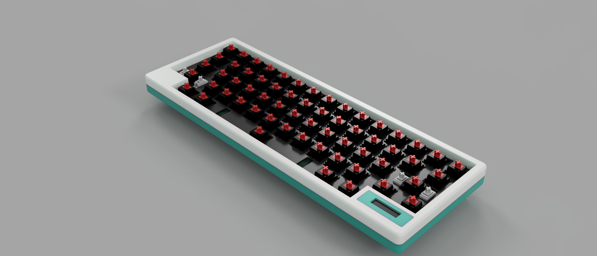

## 
MONA60 设计简介

**设计理念：**
1. 键盘，首先是一个键盘，一定是那个经常用都很稳定，又很舒适的键盘！所以第一要保证功能，保证可靠，保证人体工学设计！
2. 省掉那些不必要的花哨设计，回归本质，它一定是那种简约大气，百看不厌，能给输入带来快感的存在！
3. 情绪价值：一把键盘，对输入量比较大的用户来说它是你的朋友，给你每天的陪伴，他能给你的是轻快而又开心的体验！

mona60它应该做到了，虽然还不完美，但是它在努力！

**设计细节：**
1. 16.5厚度（普遍是18.5），空间几乎用到极限，这样能提供更舒适的手腕仰角；
2. 四个角用到了G3圆角，更顺滑的过渡，触感更丝滑；
3. 键盘仰角6.5度，人体工学比较舒适的角度！
4. 小屏幕的存在能让许多信息数字化，可视化，比如连接状态，蓝牙有多个连接可以确定当前连接；电池电量，防止突然没电的尴尬！WPM的展示让输入效率数字化，有利于改进和提高自己的输入效率！
5. 功能性的东西几乎都是满配！自定义按键，灯，Tap-Dances，支持Macros......
6. 背面的type-c口是贴桌面设计，我的桌面经常被这些离桌面比较高的插口搞的很难整理；所以想要工整的走线它应该能满足你；这个孔机加工的难度可不一般，很难装夹。
7. 超级省电的自休眠模式，几乎让你忘记它可以usb输入！
8. 会呼吸的RGB背景灯在深夜里真的会有用，抚平你那颗焦虑的心！
9. top结构加碳纤维定位板，发挥稳定，不挑轴体，让平价轴也能拥有美妙的打字音，非常治愈！
10. 整个外壳并没有用铝材质，主要原因两个：铝材重量太重，不方便携带；在冬天用起来，铝会冰冰的，带来不好的体验；
11. 为什么选择hhkb配列：大键盘，小键盘以及人体工学键盘，这些都调研了很久，其实这和使用场景有关系；
      hhkb配列的优势也比较明显：减少输入劳累，手的移动距离变小了；方便携带，适合长期输入使用；
12. 装配：外壳螺丝装配，稳定，方便携带；type-c小板与pcb连接线是插拔方式，以及小屏幕都是插拔方式，虽然成本上升，但是对于喜欢diy声音的玩家来说非常友好，即稳定又方便；
