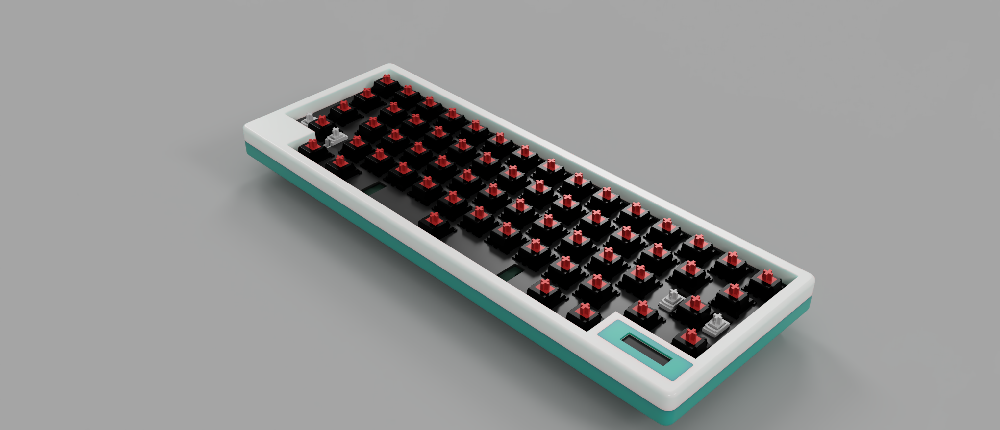

## 
MONA60 Design Introduction

**Design Philosophy:**

1. **A Keyboard First:** A keyboard must be exceptionally reliable and comfortable for daily heavy use. Our absolute highest priorities are functionality, reliability, and ergonomic design.
2. **Back to Basics:** By trimming away unnecessary, flashy gimmicks, we returned to the core essence of the object. The MONA60 is a sleek, timeless keyboard that delivers pure satisfaction with every keystroke.
3. **Emotional Value:** For heavy typists, a keyboard is a companion that offers daily comfort. It should provide a light, effortless, and joyful typing experience.

The MONA60 achieves exactly that. While no product is flawless, it constantly strives for perfection.

**Design Details:**

1. **Ultra-Slim Profile:** With a front height of just 16.5mm (compared to the industry standard of 18.5mm), we pushed internal space utilization to its absolute limit to provide a much more comfortable wrist angle.
2. **G3 Continuous Curved Corners:** The four corners utilize a premium G3 curvature, delivering seamless visual transitions and a silky-smooth tactile feel.
3. **6.5-Degree Typing Angle:** Engineered at a 6.5-degree tilt to offer the most natural and ergonomically comfortable typing stance.
4. **Integrated OLED Display:** The small screen translates critical info into clean data visuals. Check active multi-device Bluetooth connections at a glance, monitor precise battery levels to avoid sudden shutdowns, and track your real-time WPM to gauge and optimize typing efficiency.
5. **Fully Packaged Features:** It comes fully loaded with premium functionalities—supporting completely custom keymaps, customizable RGB lighting, Tap-Dance layouts, custom Macros, and more.
6. **Flush Type-C Port Design:** Traditional high-set ports often create messy cable routing on desks. The MONA60 features a Type-C cutout that aligns flush with your desk surface for flawless cable management. (This structural design requires intricate machining and complex fixturing setup).
7. **Ultra-Efficient Auto-Sleep:** Featuring an incredibly energy-efficient auto-sleep mode, the battery life is so long you will practically forget it can even be plugged in via USB.
8. **Breathing RGB Underglow:** The soft, breathing ambient lighting provides a soothing visual anchor during late-night sessions, calming a busy mind.
9. **Top Mount Configuration + Carbon Fiber Plate:** This combination guarantees consistent structural stability and a forgiving acoustic profile. It works beautifully with any switch type, enabling even budget-friendly switches to produce a satisfying, crisp, and healing typing sound.
10. **Composite Chassis Construction:** We deliberately bypassed traditional aluminum casing for two primary reasons: aluminum adds excessive weight for portable travel, and its metallic surface gets uncomfortably ice-cold to the touch during winter.
11. **Why the HHKB Layout?** After extensive research across full-sized, TKL, and split ergonomic layouts, we found that optimal configuration comes down to use-case. The HHKB layout excels by minimizing hand movement to reduce fatigue, making it highly portable and ideal for long-duration typing.
12. **DIY-Friendly Internal Assembly:** Built with a rock-solid, screw-fastened external enclosure. For internal components, both the Type-C daughterboard and the OLED screen connect to the PCB via hot-swappable JST ribbon connectors. While this increases production costs, it makes it exceptionally stable and user-friendly for enthusiasts who love disassembling their boards to fine-tune sound dampening.
